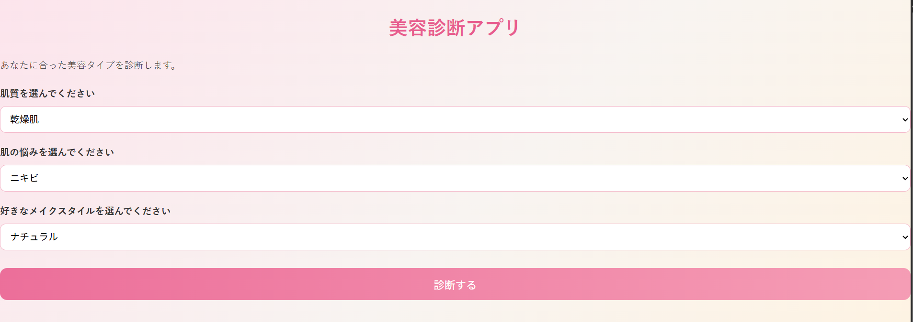
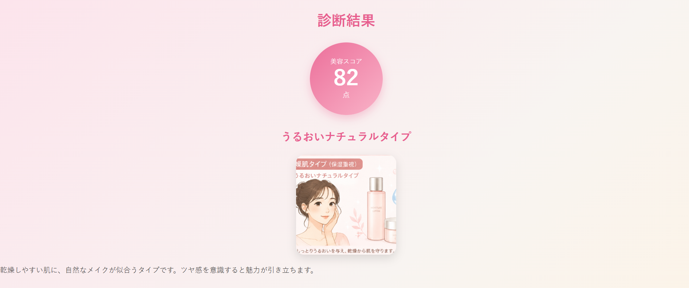
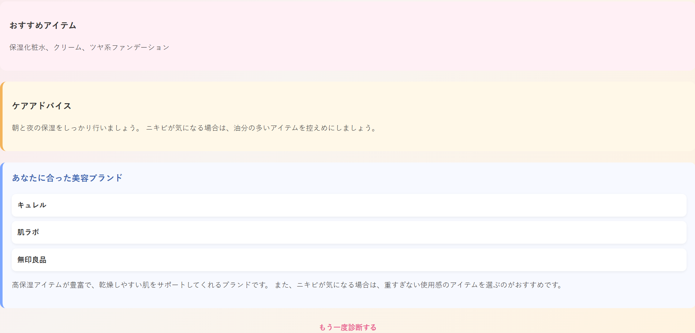

# Beauty Diagnosis App

## 概要

肌質・肌悩み・メイクスタイルから美容タイプを診断するWebアプリケーションです。

診断結果に応じて美容スコアやおすすめアイテム、ケアアドバイス、おすすめブランドを表示します。

---

## 使用技術

### Backend

* Java 17
* Spring Boot
* Spring MVC

### Frontend

* HTML
* CSS
* Thymeleaf

### Development Tool

* Eclipse
* Maven
* GitHub

---

## 主な機能

### 美容診断

以下の項目から診断を行います。

* 肌質
  * 乾燥肌
  * 脂性肌
  * 敏感肌
  * 普通肌

* 肌悩み
  * ニキビ
  * 毛穴
  * くすみ
  * 特になし

* メイクスタイル
  * ナチュラル
  * かわいい系
  * クール系

---

### 診断結果表示

診断内容に応じて以下を表示します。

* 診断タイプ
* 美容スコア
* おすすめアイテム
* ケアアドバイス
* おすすめブランド

---

### タイプ別画像表示

診断結果ごとに異なる画像を表示します。

---

## 画面イメージ

### 診断画面

### 診断結果①

### 診断結果②

---

## 工夫した点

* 条件分岐を利用して診断結果を動的に変更
* 肌悩みに応じてアドバイス内容を追加
* 診断タイプごとにおすすめブランドを変更
* ユーザーが見やすいデザインを意識して作成

---

## 今後追加予定

* MySQLによる診断履歴保存
* ログイン機能
* お気に入り機能
* レスポンシブ対応
* 管理者機能

---

## 作成者

やまと

Java / Spring Boot を中心にWebアプリケーション開発を学習中です。
